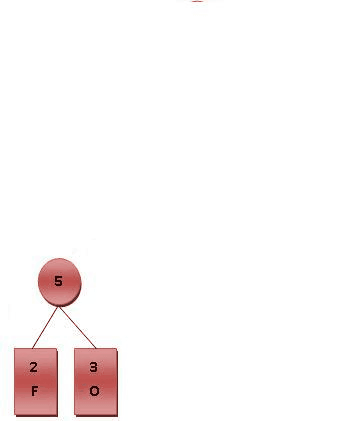

# Proposta do Trabalho :books:

Neste trabalho, o objetivo é criar um sistema que possibilite a funcionalidade de autocompletar e oferecer sugestões de palavras aos usuários. Para atingir essa finalidade, adotaremos aestrutura da árvore binária como base. A seguir, é apresentado os passos necessários para a implementação.

* **PASSO 1: COLETA DE DADOS** :1st_place_medal:

Ao iniciar, será solicitado ao usuário um arquivo denominado input.data, contendo uma lista de palavras. Cada palavra nesse arquivo será considerada como termo de pesquisa para o sistema.

* **PASSO 2: MODELO DE DADOS - ÁRVORES BINÁRIAS** :2nd_place_medal:

Será utilizado um conjunto de árvores binárias para construir o sistema. Essas árvores serão criadas a partir de textos previamente fornecidos (disponíveis em textos.zip). O objetivo é estabelecer uma relação entre as palavras dos textos e as palavras de pesquisa.

* **PASSO 3: SUGESTÕES DE PALAVRAS RELEVANTES** :3rd_place_medal:

Os resultados da análise serão apresentados em um arquivo chamado output.data. Esse arquivo conterá as relações entre as palavras pesquisadas e cada arquivo de texto. Além disso, a relevância de cada palavra será calculada com base em sua frequência nos textos. Para tal, utilize o trabalho recentemente realizado, o contador de palavras.

**ABORDAGEM DE IMPLEMENTAÇÃO**

A abordagem consistirá em três etapas diferentes:

  1. ```Árvore Binária Padrão```: Será implementado uma árvore binária tradicional, selecionando as palavras mais relevantes e relacionadas à pesquisa em cada texto. A relevância de uma palavra será determinada por sua frequência e proximidade palavra de pesquisa.
  2. ```Codificação de Huffman```: Será explorado o uso do código de Huffman para otimizar a árvore binária padrão. Calcularemos códigos para cada palavra e reorganizaremos a estrutura da árvore com base nesses códigos. Avaliaremos se essa abordagem oferece vantagens em relação à anterior.
  3. ```Árvore AVL```: Será implementado uma árvore AVL e repetiremos o processo de análise. Compararemos o tempo médio de processamento entre a construção da estrutura e a geração de saída em comparação com as abordagens anteriores.


# Solução do Problema :computer:

# Árvore Binária

A  ```Árvore Binária``` é uma das estruturas utilizadas para organizar e representar palavras com base em suas frequências no trabalho proposto. A seguir, será apresentada as principais estruturas utilizadas.

``` Função de Inserção```  

* A função começa recebendo um ponteiro para a raiz da Árvore Binária (root) e uma estrutura de dados chamada WordFrequency, que contém a palavra a ser inserida e sua frequência. Primeiramente, será feito a verificação se a árvore está vazia, ou seja, se a raiz é nula. Se a árvore estiver vazia, cria-se um novo nó com os dados da WordFrequency e define-se esse nó como a raiz da árvore. Se a árvore não estiver vazia, a função procede com a inserção:

    1. Compara a WordFrequency com a palavra no nó atual (root).
    2. Se a palavra a ser inserida for menor do que a palavra no nó atual, a função chama recursivamente insertIntoBinaryTree() para o filho esquerdo do nó atual (root->left).
    3. Se a palavra a ser inserida for maior ou igual à palavra no nó atual, a função chama recursivamente insertIntoBinaryTree() para o filho direito do nó atual (root->right).

A recursão continua até encontrar um local adequado para inserir a palavra, com base em sua frequência. Isso garante que as palavras mais frequentes estejam próximas à raiz da árvore, enquanto as menos frequentes estão nas folhas.

``` Função de Impressão em Pós-Ordem``` 


Nessa função, está responsável de imprimir a árvore em pós-ordem, realizada para que os filhos esquerdos e direitos de um nó sejam impressos antes do próprio nó. A função recebe um ponteiro para a raiz da Árvore Binária ```(root)```. Para imprimir em pós-ordem, é realizada de forma recursiva. A função começa imprimindo o filho esquerdo chamando ```printBinaryTreePostOrder(root->left)```, depois imprime o filho direito chamando ```printBinaryTreePostOrder(root->right)```. Por fim, a função imprime a palavra e a frequência do nó atual ```(root->word e root->frequency)```. Esse processo continua até que todos os nós da árvore tenham sido impressos em pós-ordem.

-> VAI IMPRIMIR AQUI <-

# Árvore AVL

``` Função para Obter a Altura de um Nó``` 

A ```Árvore AVL``` é uma estrutura balanceada que também foi utilizada nesse trabalho. A seguir, será apresentada as principais estruturas utilizadas.

A função getHeight() recebe um ponteiro para um nó (node) como entrada, ela calcula a altura do nó na árvore AVL. A altura de um nó é a distância entre o nó e a folha mais distante que pode ser alcançada a partir desse nó. Isso é calculado considerando as alturas dos filhos esquerdo e direito do nó. A altura do nó é armazenada no campo height da estrutura AVLNode.

``` Função para Obter o Fator de Balanceamento de um Nó```  

A função getBalanceFactor() também recebe um ponteiro para um nó (node) como entrada, ela calcula o fator de balanceamento do nó, que é a diferença entre a altura do filho esquerdo e a altura do filho direito. Isso é importante para determinar se a árvore está desbalanceada. O fator de balanceamento é usado para decidir qual rotação (simples ou dupla) deve ser aplicada para restaurar o balanceamento da árvore.

# Funções de Rotação (Rotativas Simples e Duplas)

* ```AVLNode rotateRight(AVLNode y)**:``` Esta função realiza uma rotação simples à direita em torno do nó y e retorna o novo nó que se torna a raiz da subárvore.

* ```AVLNode rotateLeft(AVLNode x)**:``` Esta função realiza uma rotação simples à esquerda em torno do nó x e retorna o novo nó que se torna a raiz da subárvore.

* ```AVLNode rotateLeftRight(AVLNode node)**:``` Esta função realiza uma rotação dupla, primeiro à esquerda e depois à direita, para corrigir o balanceamento da árvore. Ela recebe o nó node como entrada e retorna o novo nó que se torna a raiz da subárvore.

* ```AVLNode rotateRightLeft(AVLNode node)**:``` Similar à função anterior, esta realiza uma rotação dupla, primeiro à direita e depois à esquerda, para corrigir o balanceamento da árvore. Também recebe o nó node como entrada e retorna o novo nó que se torna a raiz da subárvore.

``` Função de Inserção na Árvore AVL``` 

A função insertIntoAVL() recebe um ponteiro para a raiz da Árvore AVL (root) e uma estrutura de dados WordFrequency contendo a palavra a ser inserida e sua frequência. A inserção é realizada de forma semelhante à inserção em uma Árvore Binária padrão, garantindo que as palavras sejam inseridas de acordo com suas frequências. Após a inserção, a função verifica se a árvore está desbalanceada e, se necessário, aplica rotações para restaurar o balanceamento.

``` Função de Impressão em Pós-Ordem na Árvore AVL``` 

A função printAVLTreePostOrder() é responsável por imprimir a Árvore AVL em pós-ordem, seguindo a mesma lógica da Árvore Binária, ela recebe um ponteiro para a raiz da Árvore AVL (root) como entrada. A impressão é realizada de forma recursiva, imprimindo os filhos esquerdos, os filhos direitos e, por fim, o nó atual (palavra e frequência).

-> VAI IMPRIMIR AQUI <-

# Huffman

A ``` Árvore de Huffman```  é a última estrutura utilizada no trabalho, possuindo sua importância para autocompletar e oferecer sugestões de palavras. A seguir, será apresentada as principais estruturas utilizadas.

``` Função para Construir a Árvore de Huffman```  

A função ```buildHuffmanTree()``` recebe um vetor de estruturas WordFrequency, que contém palavras e suas frequências, ela constrói a Árvore de Huffman a partir dessas palavras e frequências, seguindo o algoritmo de construção de Huffman:

* Inicialmente, cria-se um nó da Árvore de Huffman para cada palavra no vetor WordFrequency, com sua frequência como valor.
* Coloca-se todos os nós em uma fila de prioridade (min-heap) com base em suas frequências. Os nós com menores frequências têm prioridade mais alta na fila.
* Enquanto houver mais de um nó na fila:
    1. Remove os dois nós com as menores frequências da fila.
    2. Cria um novo nó pai com a soma das frequências dos dois nós removidos. Este novo nó torna-se pai dos dois nós removidos.
    3. Insere o novo nó de volta na fila de prioridade.
* Quando restar apenas um nó na fila, ele se torna a raiz da Árvore de Huffman.

A função retorna a raiz da Árvore de Huffman construída.

```Função de Impressão em Pós-Ordem na Árvore de Huffman```

A função printHuffmanTreePostOrder() é responsável por imprimir a Árvore de Huffman em pós-ordem, seguindo a mesma lógica das árvores anteriores, ela recebe um ponteiro para a raiz da Árvore de Huffman (root) como entrada. A impressão é realizada de forma recursiva, imprimindo os filhos esquerdos, os filhos direitos e, por fim, o nó atual (palavra e frequência) com seu código Huffman associado.


-> VAI IMPRIMIR AQUI <-

# Comparação entre as árvores

Árvore Binária: A construção da Árvore Binária é rápida, pois não requer operações de balanceamento complexas.
Árvore AVL: A construção da Árvore AVL é um pouco mais lenta devido às operações de balanceamento, mas ainda é eficiente.
Árvore de Huffman: A construção da Árvore de Huffman envolve a criação de uma árvore binária completa, que é relativamente mais lenta, mas ocorre apenas uma vez.


# A lógica :bulb:

```Árvore Binária```

Árvores binárias são estruturas de dados fundamentais no contexto de Ciência da Computação. Em particular, Árvores Binárias de Pesquisa são aplicadas na solução de diversos problemas que demandam eficiência em operações básicas, como busca, inserção e remoção. Informalmente, uma Árvore Binária de Pesquisa (BST)1 é uma estrutura de dados de árvore binária baseada em nós, onde a subárvore à esquerda de cada nó possui valores numéricos inferiores ao nó e a subárvore à direita de cada nó possui valores numéricos superiores ao nó. Formalmente, uma BST é definida recursivamente da seguinte forma:

* A é uma árvore nula;
* A é uma tripla (Esq,raiz,Dir), onde Esq e Dir são árvores binárias de pesquisa e Esq contém apenas valores menores do que o armazenado na raiz, enquanto Dir contém apenas valores maiores do que o armazenado na raiz.

<p align="center">

</p>
<p align="center">
<em>Imagem 1: Exemplo de Árvore Binária. </em>
</p>

```Codificação de Huffman```

Uma árvore binária completa, chamada de árvore de Huffman é construída recursivamente a partir da junção dos dois símbolos de menor probabilidade, que são então somados em símbolos auxiliares e estes símbolos auxiliares recolocados no conjunto de símbolos. O processo termina quando todos os símbolos forem unidos em símbolos auxiliares, formando uma árvore binária. A árvore é então percorrida, atribuindo-se valores binários de 1 ou 0 para cada aresta, e os códigos são gerados a partir desse percurso.

<p align="center">

</p>
<p align="center">
<em>Imagem 2: Exemplo do Algoritmo de Huffman. </em>
</p>

```Árvore AVL```

Árvore AVL é uma árvore binária de busca balanceada, ou seja, uma árvore balanceada (árvore completa) são as árvores que minimizam o número de comparações efetuadas no pior caso para uma busca com chaves de probabilidades de ocorrências idênticas. Contudo, para garantir essa propriedade em aplicações dinâmicas, é preciso reconstruir a árvore para seu estado ideal a cada operação sobre seus nós (inclusão ou exclusão), para ser alcançado um custo de algoritmo com o tempo de pesquisa tendendo a O(logn).

As operações de busca, inserção e remoção de elementos possuem complexidade O(logn), no qual n é o número de elementos da árvore, que são aplicados a árvore de busca binária.

<p align="center">

</p>
<p align="center">
<em>Imagem 3: Exemplo de uma Árvore AVL. </em>
</p>

# Conclusão :dart:

# Compilação e Execução 	:open_file_folder:

O algoritmo disponibilizado possui um arquivo Makefile que realiza todo o procedimento de compilação e execução. Para tanto, temos as seguintes diretrizes de execução:

<div>

| Comando                |  Função                                                                                           |
| -----------------------| ------------------------------------------------------------------------------------------------- |
|  `make clean`          | Apaga a última compilação realizada contida na pasta build                                        |
|  `make`                | Executa a compilação do programa utilizando o gcc, e o resultado vai para a pasta build           |
|  `make run`            | Executa o programa da pasta build após a realização da compilação                                 |

</div>
