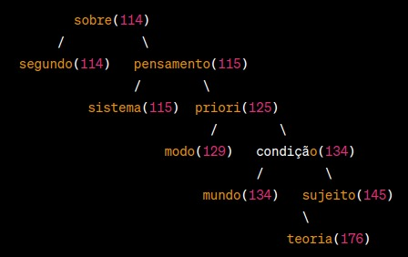

# Proposta do Trabalho :books:

Neste trabalho, o objetivo é criar um sistema que possibilite a funcionalidade de autocompletar e oferecer sugestões de palavras aos usuários. Para atingir essa finalidade, adotaremos aestrutura da árvore binária como base. A seguir, é apresentado os passos necessários para a implementação.

* **PASSO 1: COLETA DE DADOS** :1st_place_medal:

Ao iniciar, será solicitado ao usuário um arquivo denominado input.data, contendo uma lista de palavras. Cada palavra nesse arquivo será considerada como termo de pesquisa para o sistema.

* **PASSO 2: MODELO DE DADOS - ÁRVORES BINÁRIAS** :2nd_place_medal:

Será utilizado um conjunto de árvores binárias para construir o sistema. Essas árvores serão criadas a partir de textos previamente fornecidos (disponíveis em textos.zip). O objetivo é estabelecer uma relação entre as palavras dos textos e as palavras de pesquisa.

* **PASSO 3: SUGESTÕES DE PALAVRAS RELEVANTES** :3rd_place_medal:

Os resultados da análise serão apresentados em um arquivo chamado output.data. Esse arquivo conterá as relações entre as palavras pesquisadas e cada arquivo de texto. Além disso, a relevância de cada palavra será calculada com base em sua frequência nos textos. Para tal, utilize o trabalho recentemente realizado, o contador de palavras.

**ABORDAGEM DE IMPLEMENTAÇÃO**

A abordagem consistirá em três etapas diferentes:

  1. ```Árvore Binária Padrão```: Será implementado uma árvore binária tradicional, selecionando as palavras mais relevantes e relacionadas à pesquisa em cada texto. A relevância de uma palavra será determinada por sua frequência e proximidade palavra de pesquisa.
  2. ```Codificação de Huffman```: Será explorado o uso do código de Huffman para otimizar a árvore binária padrão. Calcularemos códigos para cada palavra e reorganizaremos a estrutura da árvore com base nesses códigos. Avaliaremos se essa abordagem oferece vantagens em relação à anterior.
  3. ```Árvore AVL```: Será implementado uma árvore AVL e repetiremos o processo de análise. Compararemos o tempo médio de processamento entre a construção da estrutura e a geração de saída em comparação com as abordagens anteriores.


# Solução do Problema :computer:

```INPUT```

O Input fornecido pelo professor, apresenta um conjunto de arquivos de texto como entrada. Ele processa esses arquivos para calcular a frequência das palavras e, em seguida, encontra as palavras de maior frequência em cada arquivo. Abaixo está uma explicação detalhada sobre o input do código:

* ```Número de Arquivos de Entrada (numFiles):``` O código é projetado para processar um conjunto de arquivos de texto. O número total de arquivos a serem processados é definido pela variável ```numFiles```. Neste caso, numFiles está definido como 6, o que significa que o código processará 6 arquivos de texto de entrada. Você pode ajustar esse valor de acordo com o número de arquivos que deseja processar.

* ```Arquivos de Stopwords:``` O código assume a existência de um arquivo chamado "stopword.txt" no diretório "src/dataset/". Esse arquivo contém uma lista de stopwords, que são palavras comuns que geralmente são ignoradas durante o processamento de texto. As stopwords são lidas a partir deste arquivo e armazenadas em um conjunto (unordered_set) chamado stopwords. Isso permite que o código exclua essas palavras comuns da contagem de frequência.

* ```Processamento de Texto:``` O código itera sobre cada arquivo de entrada ("input1.txt" a "input6.txt") e executa as seguintes etapas de processamento de texto:

	1. Lê o conteúdo do arquivo de texto.
	2. Divide o texto em palavras individuais.
	3. Converte todas as palavras em letras minúsculas para garantir a uniformidade.
	4. Remove qualquer pontuação no início ou no final das palavras.
	5. Verifica se a palavra não é uma palavra vazia e contém letras alfabéticas.
	6. Verifica se a palavra não está na lista de stopwords. Se não for uma stopword, ela é incluída na contagem de frequência.

* ```Cálculo de Frequência:``` O código mantém uma estrutura de dados chamada frequencyMap, que é um mapa não ordenado (unordered_map) que associa palavras às suas frequências. À medida que o código processa o texto, ele atualiza esse mapa com a contagem de frequência de cada palavra relevante.

* ```Encontrar Palavras de Maior Frequência:``` Após processar o arquivo de texto, o código utiliza a função findTopK() para encontrar as 10 palavras de maior frequência no arquivo. Isso é feito usando um min-heap (fila de prioridade) para manter as palavras de maior frequência. A função findTopK() insere as palavras no min-heap e, se o tamanho do heap exceder 10, ela remove a palavra com a menor frequência. Portanto, ao final do processamento de um arquivo, o min-heap contém as top 10 palavras de maior frequência desse arquivo.

```OUTPUT esperado:``` É esperado imprimir, ao final do código, o texto que está sendo percorrido as árvores, as palavras de maior frequência, a próxima palavra da árvore, a frequência da maior palavra, e o total de palavras dentro do arquivo. Além disso, também tem a função de medir o tempo de execução para as operações de cada estrutura de árvore (Árvore Binária, Árvore AVL e Árvore de Huffman) e imprime esses tempos, permitindo uma comparação de desempenho entre elas.

# HeapSort

O ```HeapSort``` processa vários arquivos de texto, calcula a frequência das palavras nesses textos e, em seguida, encontra as palavras de maior frequência. Ele utiliza três estruturas de árvore diferentes (Árvore Binária, Árvore AVL e Árvore de Huffman) para armazenar e processar essas palavras. A seguir, será mostrado o funcionamento do Heapsort utilizado no código código.

* Primeiro, o código lê os arquivos de texto e processa as palavras, excluindo as stopwords (palavras comuns que não são relevantes para a análise).

* Para cada arquivo de texto, o código encontra as 10 palavras de maior frequência usando a função findTopK(). Essa função utiliza um min-heap (fila de prioridade) para manter as palavras de maior frequência.

* A função findTopK() insere as palavras no min-heap e, se o tamanho do heap exceder k (10 neste caso), ela remove a palavra com a menor frequência. Isso garante que o heap contenha sempre as top k palavras.

* Após processar os arquivos de texto, o código imprime as top k palavras encontradas para cada arquivo, bem como a frequência delas.

# Árvore Binária :deciduous_tree:

A  ```Árvore Binária``` é uma das estruturas utilizadas para organizar e representar palavras com base em suas frequências no trabalho proposto. A seguir, será apresentada as principais estruturas utilizadas.

``` Função de Inserção```  

* A função começa recebendo um ponteiro para a raiz da Árvore Binária (root) e uma estrutura de dados chamada WordFrequency, que contém a palavra a ser inserida e sua frequência. Primeiramente, será feito a verificação se a árvore está vazia, ou seja, se a raiz é nula. Se a árvore estiver vazia, cria-se um novo nó com os dados da WordFrequency e define-se esse nó como a raiz da árvore. Se a árvore não estiver vazia, a função procede com a inserção:

    1. Compara a WordFrequency com a palavra no nó atual (root).
    2. Se a palavra a ser inserida for menor do que a palavra no nó atual, a função chama recursivamente insertIntoBinaryTree() para o filho esquerdo do nó atual (root->left).
    3. Se a palavra a ser inserida for maior ou igual à palavra no nó atual, a função chama recursivamente insertIntoBinaryTree() para o filho direito do nó atual (root->right).

A recursão continua até encontrar um local adequado para inserir a palavra, com base em sua frequência. Isso garante que as palavras mais frequentes estejam próximas à raiz da árvore, enquanto as menos frequentes estão nas folhas.

``` Função de Impressão em Pós-Ordem``` 

Nessa função, está responsável de imprimir a árvore em pós-ordem, realizada para que os filhos esquerdos e direitos de um nó sejam impressos antes do próprio nó. A função recebe um ponteiro para a raiz da Árvore Binária ```(root)```. Para imprimir em pós-ordem, é realizada de forma recursiva. A função começa imprimindo o filho esquerdo chamando ```printBinaryTreePostOrder(root->left)```, depois imprime o filho direito chamando ```printBinaryTreePostOrder(root->right)```. Por fim, a função imprime a palavra e a frequência do nó atual ```(root->word e root->frequency)```. Esse processo continua até que todos os nós da árvore tenham sido impressos em pós-ordem.

<p align="center">

</p>
<p align="center">
<em>Imagem 1: Árvore Binária com as palavras do OUTPUT. </em>
</p>

# Árvore AVL :deciduous_tree:

``` Função para Obter a Altura de um Nó``` 

A ```Árvore AVL``` é uma estrutura balanceada que também foi utilizada nesse trabalho. A seguir, será apresentada as principais estruturas utilizadas.

A função getHeight() recebe um ponteiro para um nó (node) como entrada, ela calcula a altura do nó na árvore AVL. A altura de um nó é a distância entre o nó e a folha mais distante que pode ser alcançada a partir desse nó. Isso é calculado considerando as alturas dos filhos esquerdo e direito do nó. A altura do nó é armazenada no campo height da estrutura AVLNode.

``` Função para Obter o Fator de Balanceamento de um Nó```  

A função getBalanceFactor() também recebe um ponteiro para um nó (node) como entrada, ela calcula o fator de balanceamento do nó, que é a diferença entre a altura do filho esquerdo e a altura do filho direito. Isso é importante para determinar se a árvore está desbalanceada. O fator de balanceamento é usado para decidir qual rotação (simples ou dupla) deve ser aplicada para restaurar o balanceamento da árvore.

# Funções de Rotação (Rotativas Simples e Duplas)

* ```AVLNode rotateRight(AVLNode y)**:``` Esta função realiza uma rotação simples à direita em torno do nó y e retorna o novo nó que se torna a raiz da subárvore.

* ```AVLNode rotateLeft(AVLNode x)**:``` Esta função realiza uma rotação simples à esquerda em torno do nó x e retorna o novo nó que se torna a raiz da subárvore.

* ```AVLNode rotateLeftRight(AVLNode node)**:``` Esta função realiza uma rotação dupla, primeiro à esquerda e depois à direita, para corrigir o balanceamento da árvore. Ela recebe o nó node como entrada e retorna o novo nó que se torna a raiz da subárvore.

* ```AVLNode rotateRightLeft(AVLNode node)**:``` Similar à função anterior, esta realiza uma rotação dupla, primeiro à direita e depois à esquerda, para corrigir o balanceamento da árvore. Também recebe o nó node como entrada e retorna o novo nó que se torna a raiz da subárvore.

``` Função de Inserção na Árvore AVL``` 

A função insertIntoAVL() recebe um ponteiro para a raiz da Árvore AVL (root) e uma estrutura de dados WordFrequency contendo a palavra a ser inserida e sua frequência. A inserção é realizada de forma semelhante à inserção em uma Árvore Binária padrão, garantindo que as palavras sejam inseridas de acordo com suas frequências. Após a inserção, a função verifica se a árvore está desbalanceada e, se necessário, aplica rotações para restaurar o balanceamento.

``` Função de Impressão em Pós-Ordem na Árvore AVL``` 

A função printAVLTreePostOrder() é responsável por imprimir a Árvore AVL em pós-ordem, seguindo a mesma lógica da Árvore Binária, ela recebe um ponteiro para a raiz da Árvore AVL (root) como entrada. A impressão é realizada de forma recursiva, imprimindo os filhos esquerdos, os filhos direitos e, por fim, o nó atual (palavra e frequência).

<p align="center">

</p>
<p align="center">
<em>Imagem 2: Árvore AVL com as palavras do OUTPUT. </em>
</p>

# Huffman :deciduous_tree:

A ``` Árvore de Huffman```  é a última estrutura utilizada no trabalho, possuindo sua importância para autocompletar e oferecer sugestões de palavras. A seguir, será apresentada as principais estruturas utilizadas.

``` Função para Construir a Árvore de Huffman```  

A função ```buildHuffmanTree()``` recebe um vetor de estruturas WordFrequency, que contém palavras e suas frequências, ela constrói a Árvore de Huffman a partir dessas palavras e frequências, seguindo o algoritmo de construção de Huffman:

* Inicialmente, cria-se um nó da Árvore de Huffman para cada palavra no vetor WordFrequency, com sua frequência como valor.
* Coloca-se todos os nós em uma fila de prioridade (min-heap) com base em suas frequências. Os nós com menores frequências têm prioridade mais alta na fila.
* Enquanto houver mais de um nó na fila:
    1. Remove os dois nós com as menores frequências da fila.
    2. Cria um novo nó pai com a soma das frequências dos dois nós removidos. Este novo nó torna-se pai dos dois nós removidos.
    3. Insere o novo nó de volta na fila de prioridade.
* Quando restar apenas um nó na fila, ele se torna a raiz da Árvore de Huffman.

A função retorna a raiz da Árvore de Huffman construída.

```Função de Impressão em Pós-Ordem na Árvore de Huffman```

A função printHuffmanTreePostOrder() é responsável por imprimir a Árvore de Huffman em pós-ordem, seguindo a mesma lógica das árvores anteriores, ela recebe um ponteiro para a raiz da Árvore de Huffman (root) como entrada. A impressão é realizada de forma recursiva, imprimindo os filhos esquerdos, os filhos direitos e, por fim, o nó atual (palavra e frequência) com seu código Huffman associado.


<p align="center">

</p>
<p align="center">
<em>Imagem 3: Codificação de Huffman com as palavras do OUTPUT. </em>
</p>

# Velocidade de Execução - Comparação entre as Árvores :zap:

A velocidade de inserção em uma ```Árvore Binária``` é geralmente rápida, pois envolve comparações simples para determinar a posição de inserção. No entanto, a velocidade de busca pode variar significativamente com base no balanceamento da árvore. Em um cenário desbalanceado, a busca pode ser muito lenta, com complexidade O(n), onde n é o número de palavras. Isso resulta em um custo computacional elevado, especialmente em cenários de busca intensiva.

A ```Árvore AVL``` mantém o balanceamento automaticamente durante a inserção, resultando em uma velocidade de inserção eficiente, com complexidade média de O(log n), onde n é o número de palavras. A velocidade de busca em uma Árvore AVL também é eficiente, com complexidade média de O(log n). Embora as operações de balanceamento tenham um custo computacional, elas garantem que a árvore permaneça balanceada, resultando em um melhor desempenho em cenários de busca.

A construção da ```Árvore de Huffman``` é relativamente mais lenta, pois envolve a criação de uma árvore binária completa. No entanto, essa construção ocorre apenas uma vez. Após a construção, a busca por palavras é rápida, pois palavras comuns são representadas por códigos curtos. O custo computacional da construção da Árvore de Huffman é elevado devido ao algoritmo de criação da árvore, mas a compressão resultante economiza espaço de armazenamento.

| Árvore          | Complexidade no Pior Caso | Complexidade Média (Inserção/Busca) |
|-----------------|---------------------------|-------------------------------------|
| Árvore Binária  | O(n)                      | -                                   |
| Árvore AVL      | O(log n)                  | O(log n)                            |
| Árvore de Huffman | Elevado (Construção)    | O(log n) (Busca após construção)    |


*  Para operações de busca, a Árvore AVL é a mais eficiente entre as três, com complexidade O(log n) tanto no pior caso quanto na média.
*  A Árvore de Huffman é eficaz para busca após a construção, mas a construção em si é computacionalmente custosa, tornando-a mais adequada para cenários onde a árvore é construída uma única vez e usada para várias operações de busca.
*  A Árvore Binária não é otimizada para busca e, portanto, não é recomendada para aplicações que requerem eficiência nesse aspecto.

Em resumo, a escolha entre essas árvores depende das necessidades específicas da aplicação. Se a busca é a operação crítica, a Árvore AVL é a melhor escolha. Se a prioridade é a compressão de dados, a Árvore de Huffman é apropriada, desde que a construção seja um processo infrequente.

```OUTPUT```

Em resumo, o output do código fornece uma visão detalhada das palavras de maior frequência em cada arquivo de texto, além de mostrar a estrutura das três árvores usadas e seus tempos de execução. Isso ajuda na análise de desempenho e na compreensão de como cada estrutura de dados se comporta com relação aos dados de entrada.

<p align="center">

</p>
<p align="center">
<em>Imagem 4: Exemplo do começo de OUTPUT do arquivo 01. </em>
</p>

A impressão em pós-ordem segue a ordem de visita dos nós, começando pelos nós filhos da esquerda, seguidos pelos nós filhos da direita e, finalmente, pelo próprio nó. Isso resulta em uma impressão das palavras da árvore em ordem decrescente de frequência.

Cada nó é impresso no formato (palavra: frequência) e é separado por espaços para facilitar a leitura.

Dessa forma, o processo de criação e impressão da árvore no output permite visualizar claramente as palavras de maior frequência e sua organização hierárquica com base na relevância. Essa saída é útil para análise e compreensão dos resultados da análise de texto.

<p align="center">

</p>
<p align="center">
<em>Imagem 5: Construção da árvore ao decorrer do arquivo no OUTPUT. </em>
</p>


# A lógica :bulb:

```HeapSort```

O Heapsort é um algoritmo de ordenação por seleção que se baseia na estrutura de um heap binário. Ele consiste em três etapas principais: construir um heap a partir do conjunto de elementos, extrair elementos do heap (que estão sempre na ordem correta) e reorganizar o heap após cada extração.

* ```Construção do Heap (Heapify):``` A primeira etapa do Heapsort envolve a construção de um heap a partir do conjunto de elementos a serem ordenados. Isso é feito da seguinte maneira:

  1. Começamos com um array desordenado.
  2. Transformamos esse array em um heap binário, garantindo que a propriedade do heap seja mantida. Isso envolve comparar cada elemento com seus filhos e, se necessário, trocar elementos para manter a propriedade do heap.
  3. Após a construção do heap, o maior elemento estará na raiz do heap.

* ```Extração e Reorganização:``` Na segunda etapa, o maior elemento do heap (que está na raiz) é removido e colocado na posição apropriada no array ordenado. A propriedade do heap é então restaurada para o restante dos elementos no heap, garantindo que o próximo maior elemento esteja na raiz. Esse processo é repetido até que todos os elementos tenham sido extraídos e colocados no array ordenado.

* ```Funcionamento do Heap:``` A estrutura do heap é uma árvore binária completa em que cada nó tem um valor maior ou igual ao de seus filhos (no caso de um heap máximo) ou menor ou igual ao de seus filhos (no caso de um heap mínimo). Essa propriedade garante que o maior (ou menor) elemento esteja sempre na raiz do heap.

* ```Vantagens do Heapsort:```
  1. O Heapsort é eficiente em termos de tempo de execução, com uma complexidade de tempo de O(n log n), o que o torna mais rápido do que alguns outros algoritmos de ordenação, como o Bubble Sort e o Insertion Sort, em média.
  2. Ele não requer espaço adicional, pois a ordenação é realizada no próprio array de entrada.
  3. O Heapsort é um algoritmo de ordenação estável, o que significa que a ordem relativa dos elementos com chaves iguais é preservada.

* ```Desvantagens do Heapsort:```

  1. Apesar de sua eficiência em termos de tempo, o Heapsort não é tão rápido quanto algoritmos de ordenação como o Quick Sort ou o Merge Sort em casos médios e em algumas situações.
  2. O algoritmo é in-place, o que significa que não é adequado para ordenar grandes conjuntos de dados quando o uso de memória é uma preocupação.

Em resumo, o Heapsort é um algoritmo de ordenação eficiente que se baseia na estrutura de um heap binário. Ele é capaz de ordenar conjuntos de dados de forma estável com uma complexidade de tempo de O(n log n) e não requer espaço adicional. No entanto, em alguns cenários, outros algoritmos de ordenação podem ser mais rápidos.

<p align="center">

</p>
<p align="center">
<em>Imagem 6: Exemplo de HeapSort. </em>
</p>

```Árvore Binária```

Uma árvore binária é uma estrutura de dados hierárquica e não linear usada em ciência da computação e matemática. Ela é composta por um conjunto de elementos chamados "nós", onde cada nó pode ter até dois "filhos": um filho esquerdo e um filho direito. Os nós de uma árvore binária são conectados por meio de "arestas".

* ```Definição de Nó:``` Cada nó em uma árvore binária contém um valor ou dado associado, que pode ser qualquer tipo de dado, como números inteiros, caracteres ou até mesmo estruturas de dados mais complexas.

* ```Relação entre Nós:``` Cada nó em uma árvore binária tem, no máximo, dois filhos: um filho esquerdo e um filho direito. Os filhos de um nó são conectados ao nó pai por meio de arestas direcionadas.

* ```Raiz da Árvore:``` O nó no topo da árvore é chamado de "raiz". Ele é o único nó na árvore que não tem um pai. É a partir da raiz que toda a estrutura da árvore se ramifica.

* ```Folhas:``` Os nós na parte inferior da árvore que não têm filhos são chamados de "folhas" ou "nós folha".

* ```Altura da Árvore:``` A "altura" da árvore é a distância entre a raiz e o nó mais distante da árvore. É a medida da profundidade máxima da árvore.

* ```Travessias:``` Existem várias maneiras de percorrer ou "travessar" uma árvore binária para acessar seus nós, como travessia em ordem (in-order), travessia pré-ordem (pre-order) e travessia pós-ordem (post-order).

A principal característica das árvores binárias é que elas permitem uma estrutura hierárquica de dados que pode ser usada para armazenar informações de forma organizada e eficiente. Uma aplicação comum das árvores binárias é a implementação de Árvores Binárias de Pesquisa (BST), onde os nós são organizados de tal forma que os valores menores estão à esquerda e os valores maiores estão à direita.

As árvores binárias são amplamente utilizadas em algoritmos de busca, estruturas de dados, processamento de árvores de análise sintática em linguagens de programação, e em muitos outros campos da ciência da computação e matemática devido à sua versatilidade e eficiência.

<p align="center">

</p>
<p align="center">
<em>Imagem 7: Exemplo de Árvore Binária. </em>
</p>

```Codificação de Huffman```

A Codificação de Huffman é um método de compactação de dados que utiliza uma árvore binária especial chamada "Árvore de Huffman". Esta técnica é amplamente usada para compactar dados, como texto, áudio e vídeo, com o objetivo de economizar espaço de armazenamento ou largura de banda durante a transmissão. Aqui está uma explicação sobre a Árvore de Huffman e seu funcionamento:

* ```Definição da Árvore de Huffman:``` A Árvore de Huffman é uma árvore binária completa, onde cada nó interno (não folha) tem dois filhos, um à esquerda e outro à direita. Cada folha da árvore representa um caractere ou um símbolo e possui um valor associado a ele, que é geralmente a frequência de ocorrência desse caractere no conjunto de dados original.

* ```Construção da Árvore de Huffman:``` A Árvore de Huffman é construída a partir de um conjunto de caracteres e suas frequências. O algoritmo começa com cada caractere como uma folha em uma floresta de árvores individuais. Em seguida, ele mescla repetidamente as duas árvores com as menores frequências, criando uma nova árvore que tem como filhos as duas árvores mescladas. Esse processo continua até que todas as árvores estejam mescladas em uma única árvore, que se torna a Árvore de Huffman.

* ```Codificação de Huffman:``` Uma vez construída a Árvore de Huffman, a codificação de cada caractere é obtida seguindo o caminho da raiz até a folha correspondente. Cada passo para a esquerda na árvore é representado por um "0", e cada passo para a direita é representado por um "1". Portanto, a codificação de Huffman é uma representação binária onde caracteres mais frequentes têm códigos mais curtos e caracteres menos frequentes têm códigos mais longos.

 * ```Decodificação de Huffman:``` A decodificação de Huffman é o processo inverso da codificação. Começando da raiz da Árvore de Huffman, os bits de entrada são lidos um por um. À medida que cada bit é lido, o algoritmo segue para o filho correspondente (esquerda ou direita) na árvore. Quando uma folha é alcançada, o caractere associado a essa folha é emitido como parte da saída. Esse processo continua até que todos os bits de entrada sejam processados.

* ```Eficiência da Compactação:``` A Codificação de Huffman é eficiente na compactação de dados porque atribui códigos mais curtos a caracteres mais frequentes, economizando espaço em relação a representações fixas, como ASCII. Isso a torna uma técnica valiosa em compressão de dados, como em arquivos ZIP, GIF e em transmissões de áudio e vídeo.

* ```Adaptação Dinâmica:``` Uma das vantagens da Codificação de Huffman é sua capacidade de se adaptar a mudanças na frequência de caracteres. Isso significa que, se a frequência dos caracteres em um conjunto de dados mudar, a Árvore de Huffman pode ser reconstruída para otimizar a compactação com base nas novas frequências.

A Codificação de Huffman é um exemplo clássico de algoritmo de compressão que ilustra a eficiência das árvores binárias na representação de dados de forma compacta e eficaz.

<p align="center">

</p>
<p align="center">
<em>Imagem 8: Exemplo do Algoritmo de Huffman. </em>
</p>

```Árvore AVL```

A Árvore AVL é uma árvore binária de busca especial em que a diferença entre as alturas das subárvores esquerda e direita de qualquer nó (fator de balanceamento) é mantida pequena ou limitada a um valor específico (geralmente 1). Isso garante que a árvore esteja balanceada e que as operações de busca, inserção e remoção tenham complexidade média O(log n), onde "n" é o número de nós na árvore.

* ```Inserção na Árvore AVL:``` Quando um novo nó é inserido em uma Árvore AVL, a árvore verifica seu fator de balanceamento. Se o fator de balanceamento de um nó se tornar maior que 1 ou menor que -1, isso indica um desequilíbrio. A árvore aplica uma série de rotações (simples ou duplas) para restaurar o equilíbrio. Essas rotações envolvem reorganizar os nós, mantendo a propriedade de busca da árvore.

* ```Remoção na Árvore AVL:``` Quando um nó é removido de uma Árvore AVL, a árvore verifica o fator de balanceamento de seus nós pai ao longo do caminho para a raiz. Se algum nó ao longo desse caminho tiver um fator de balanceamento maior que 1 ou menor que -1, a árvore aplica rotações para restaurar o equilíbrio.

* ```Funcionamento da Rotação:``` As rotações são operações que reorganizam a árvore, alterando as ligações entre os nós.

* ```Desvantagens da Árvore AVL:``` A principal desvantagem da Árvore AVL é que as operações de inserção e remoção são mais complexas devido à necessidade de manter o equilíbrio. Isso pode resultar em uma pequena sobrecarga computacional em comparação com estruturas de dados não balanceadas, como uma Árvore Binária de Busca simples.

Em resumo, a Árvore AVL é uma árvore binária de busca balanceada que garante um bom desempenho nas operações de busca, inserção e remoção. Ela atinge esse equilíbrio por meio de rotações que mantêm o fator de balanceamento controlado, mantendo a árvore eficiente em termos de tempo de execução.

<p align="center">

</p>
<p align="center">
<em>Imagem 9: Exemplo de uma Árvore AVL. </em>
</p>

# Conclusão :dart:

O código apresentado oferece uma solução abrangente para a análise de palavras de maior frequência em vários arquivos de texto, enquanto demonstra o desempenho de três estruturas de dados fundamentais: Árvore Binária, Árvore AVL e Árvore de Huffman.

Este projeto não apenas facilita a análise de texto, mas também fornece uma compreensão clara das diferentes estruturas de dados e de suas características de desempenho. A escolha entre Árvore Binária, Árvore AVL e Árvore de Huffman dependerá das necessidades específicas do projeto, do tamanho do conjunto de dados e dos requisitos de eficiência.

A implementação destas estruturas de dados e a análise de desempenho podem servir como base para a construção de aplicativos mais complexos que envolvam processamento de texto e análise de dados. Compreender as vantagens e desvantagens de cada estrutura é fundamental para tomar decisões informadas em projetos futuros.


# Compilação e Execução 	:open_file_folder:

```1. Verificação do Arquivo de Leitura```

O programa foi projetado para processar um conjunto de arquivos de ```input(X).txt``` contidos na pasta ```dataset```. Então, para o correto funcionamento do programa:

* Verificar de incluir corretamente os arquivos no formato ```input(X).txt``` dentro da pasta ```dataset```.
* Verificar se os arquivos estão em formato ```.txt```.

```2. StopWords```

* Verificar se o arquivo ```stopword.txt``` esteja localizado na pasta ```dataset```.

O algoritmo disponibilizado possui um arquivo Makefile que realiza todo o procedimento de compilação e execução. Para tanto, temos as seguintes diretrizes de execução:

<div>

| Comando                |  Função                                                                                           |
| -----------------------| ------------------------------------------------------------------------------------------------- |
|  `make clean`          | Apaga a última compilação realizada contida na pasta build                                        |
|  `make`                | Executa a compilação do programa utilizando o gcc, e o resultado vai para a pasta build           |
|  `make run`            | Executa o programa da pasta build após a realização da compilação                                 |

</div>
